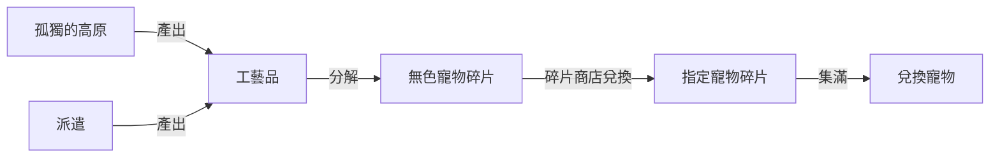

> [!important]
> 先看過 [靈魂小夥伴目錄](/post/系統/靈魂小夥伴篇/靈魂小夥伴目錄)，再回來看本頁。

## 工藝品是什麼

**工藝品**就是靈魂小夥伴的**裝備**。寵物本體決定基礎，工藝品決定上限——同一隻寵物有沒有穿好工藝品，戰力差很多。

## 取得方式

| 來源                     | 說明                                                                      |
| ------------------------ | ------------------------------------------------------------------------- |
| 孤獨的高原（前日課副本） | 主要產出工藝品                                                            |
| 派遣                     | 寵物多起來後可額外產出工藝品，見 [派遣篇](/post/系統/靈魂小夥伴篇/派遣篇) |

## 分解與碎片商店

用不到的工藝品可以**分解成無色寵物碎片**：

### 碎片商店

| 等級寵物 | 需要兌換數量 |
| -------- | ------------ |
| S級      | 90           |
| A級      | 60           |
| B級      | 30           |
| C級      | 10           |

## 相關資料

- 【攻略】新系統【靈魂小夥伴／靈魂小夥伴裝備】介紹 <https://forum.gamer.com.tw/C.php?bsn=21911&snA=8392>
- 【攻略】2023 夏季靈魂勞工入門簡易流程 <https://forum.gamer.com.tw/C.php?bsn=21911&snA=8836>
-   【情報】220818更新內容公告（8/18修正） <https://forum.gamer.com.tw/C.php?bsn=21911&snA=8396>
