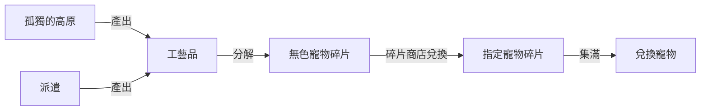

> [!important]
> 先看過 [靈魂小夥伴目錄](/post/系統/靈魂小夥伴篇/靈魂小夥伴目錄)，再回來看本頁。

## 工藝品是什麼

**工藝品**就是靈魂小夥伴的**裝備**。寵物本體決定基礎，工藝品決定上限——同一隻寵物有沒有穿好工藝品，戰力差很多。

## 取得方式

| 來源                     | 說明                                                                      |
| ------------------------ | ------------------------------------------------------------------------- |
| 孤獨的高原（前日課副本） | 主要產出工藝品                                                            |
| 派遣                     | 寵物多起來後可額外產出工藝品，見 [派遣篇](/post/系統/靈魂小夥伴篇/派遣篇) |

## 裝備

- 靈魂小夥伴最多可裝備3種工藝品，提升能力值。（僅於召喚該靈魂小夥伴時套用）
  
  
  

- 工藝品可分為藍色(Lv1)、紅色(Lv 15)與特效(Lv 30開放)三種
  
- 裝備特效工藝品時，靈魂小夥伴的周邊將會出現寵物專用特效
  
  
- 工藝品從最低的普通開始分為五個等級，分別為傳奇、獨特、稀有、奇蹟及普通
  
  
  
  
  

## 合成及交換

- 交換: 用2個工藝品交換出一個不同的工藝品

- 合成: 用1+有定數量的相同等級工藝品合成出下一級的工藝品
  

### 合成材料及費用表

| 等級  | 合成材料  | 費用       | 乙太    |
| --- | ----- | -------- | ----- |
| 普通  | N/A   | N/A      | N/A   |
| 奇蹟  | 普通x6  | 500000   | 2500  |
| 稀有  | 奇蹟x6  | 1000000  | 2500  |
| 獨特  | 稀有x11 | 5000000  | 25000 |
| 傳奇  | 獨特x16 | 10000000 | 50000 |

### 材料對照表

|     | 普通  | 奇蹟  | 稀有  | 獨特  | 傳奇   |
| --- | --- | --- | --- | --- | ---- |
| 普通  | 1   | 6   | 36  | 396 | 6336 |
| 奇蹟  | -   | 1   | 6   | 66  | 1056 |
| 稀有  | -   | -   | 1   | 11  | 176  |
| 獨特  | -   | -   | -   | 1   | 16   |
| 傳奇  | -   | -   | -   | -   | 1    |

### 費用對照表

|     | 普通  | 奇蹟     | 稀有      | 獨特       | 傳奇        |
| --- | --- | ------ | ------- | -------- | --------- |
| 普通  | 0   | 500000 | 4000000 | 49000000 | 794000000 |
| 奇蹟  | -   | 0      | 1000000 | 16000000 | 266000000 |
| 稀有  | -   | -      | 0       | 5000000  | 90000000  |
| 獨特  | -   | -      | -       | 0        | 10000000  |
| 傳奇  | -   | -      | -       | -        | 0         |

### 乙太對照表

|     | 普通  | 奇蹟   | 稀有    | 獨特     | 傳奇      |
| --- | --- | ---- | ----- | ------ | ------- |
| 普通  | 0   | 2500 | 17500 | 217500 | 3530000 |
| 奇蹟  | -   | 0    | 2500  | 52500  | 610000  |
| 稀有  | -   | -    | 0     | 25000  | 450000  |
| 獨特  | -   | -    | -     | 0      | 50000   |
| 傳奇  | -   | -    | -     | -      | 0       |

## 分解與碎片商店

用不到的工藝品可以**分解成無色靈魂小夥伴碎片**：

### 分解對照表

|     | 無色靈魂小夥伴碎片 |
| --- | --------- |
| 普通  | 1         |
| 奇蹟  | 5         |
| 稀有  | 100       |
| 獨特  | 我分不起      |
| 傳奇  | 我分不起      |

### 碎片商店

| 等級寵物 | 需要兌換數量 |
| -------- | ------------ |
| S級      | 90           |
| A級      | 60           |
| B級      | 30           |
| C級      | 10           |

## 工藝品列表

|     | 名稱          | 效果                      | 欄位  |
| --- | ----------- | ----------------------- | --- |
| 普通  | 殘破冷靜的傷口     | 攻擊力 +160                | 藍色  |
|     | **殘破冷靜的獠牙** | 暴擊傷害值 +292              | 藍色  |
|     | 殘破冷靜的羽毛     | 移動速度【%】+2%              | 藍色  |
|     | 殘破冷靜的眼眸     | 命中度 +24                 | 藍色  |
|     | 殘破冷靜的心臟     | 最大HP +600               | 藍色  |
|     | 殘破熱血的傷口     | 攻擊力 +160                | 紅色  |
|     | **殘破熱血的獠牙** | 暴擊傷害值 +292              | 紅色  |
|     | 殘破熱血的羽毛     | 移動速度【%】+2%              | 紅色  |
|     | 殘破熱血的眼眸     | 命中度 +24                 | 紅色  |
|     | 殘破熱血的心臟     | 最大HP +600               | 紅色  |
| 奇蹟  | 褪色冷靜的傷口     | 攻擊力 +320                | 藍色  |
|     | **褪色冷靜的獠牙** | 暴擊傷害值 +584              | 藍色  |
|     | 褪色冷靜的羽毛     | 移動速度【%】+3%              | 藍色  |
|     | 褪色冷靜的眼眸     | 命中度 +48                 | 藍色  |
|     | 褪色冷靜的心臟     | 最大HP +1200              | 藍色  |
|     | 褪色熱血的傷口     | 攻擊力 +320                | 紅色  |
|     | **褪色熱血的獠牙** | 暴擊傷害值 +584              | 紅色  |
|     | 褪色熱血的羽毛     | 移動速度【%】+3%              | 紅色  |
|     | 褪色熱血的眼眸     | 命中度 +48                 | 紅色  |
|     | 褪色熱血的心臟     | 最大HP +1200              | 紅色  |
| 稀有  | 神秘冷靜的傷口     | 攻擊力 +480                | 藍色  |
|     | **神秘冷靜的獠牙** | 暴擊傷害值 +876              | 藍色  |
|     | 神秘冷靜的羽毛     | 移動速度【%】+4%              | 藍色  |
|     | 神秘冷靜的眼眸     | 命中度 +72                 | 藍色  |
|     | 神秘冷靜的心臟     | 最大HP +1800              | 藍色  |
|     | 神秘熱血的傷口     | 攻擊力 +480                | 紅色  |
|     | **神秘熱血的獠牙** | 暴擊傷害值 +876              | 紅色  |
|     | 神秘熱血的羽毛     | 移動速度【%】+4%              | 紅色  |
|     | 神秘熱血的眼眸     | 命中度 +72                 | 紅色  |
|     | 神秘熱血的心臟     | 最大HP +1800              | 紅色  |
| 獨特  | **青綠悸動**    | 暴擊傷害值 + 1200；命中度 + 40   | 特效  |
|     | **冰涼雪花**    | 暴擊傷害值 + 1200；最大HP +1650 | 特效  |
|     | **刺眼閃電**    | 暴擊傷害值 + 1200；移動速度【%】+5% | 特效  |
|     | 和煦光暈        | 命中度 + 85；最大HP + 1650    | 特效  |
|     | 顯露勇猛        | 最大HP + 2400；移動速度【%】+4%  | 特效  |
|     | 璀璨冷靜的傷口     | 攻擊力 +640                | 藍色  |
|     | **璀璨冷靜的獠牙** | 暴擊傷害值 +1460             | 藍色  |
|     | 璀璨冷靜的羽毛     | 移動速度【%】+5%              | 藍色  |
|     | 璀璨冷靜的眼眸     | 命中度 +96                 | 藍色  |
|     | 璀璨冷靜的心臟     | 最大HP +2400              | 藍色  |
|     | 璀璨熱血的傷口     | 攻擊力 +640                | 紅色  |
|     | **璀璨熱血的獠牙** | 暴擊傷害值 +1460             | 紅色  |
|     | 璀璨熱血的羽毛     | 移動速度【%】+5%              | 紅色  |
|     | 璀璨熱血的眼眸     | 命中度 +96                 | 紅色  |
|     | 璀璨熱血的心臟     | 最大HP +2400              | 紅色  |
| 傳奇  | **粉紅悸動**    | 暴擊傷害值 + 1200；命中度 + 40   | 特效  |
|     | **沁白雪花**    | 暴擊傷害值 + 1200；最大HP +1650 | 特效  |
|     | **酥麻閃電**    | 暴擊傷害值 + 1200；移動速度【%】+5% | 特效  |
|     | 沉穩光暈        | 命中度 + 85；最大HP + 1650    | 特效  |
|     | 顯露冷靜        | 最大HP + 2400；移動速度【%】+4%  | 特效  |
|     | 耀眼冷靜的傷口     | 攻擊力 +800                | 藍色  |
|     | **耀眼冷靜的獠牙** | 暴擊傷害值 +1460             | 藍色  |
|     | 耀眼冷靜的羽毛     | 移動速度【%】+6%              | 藍色  |
|     | 耀眼冷靜的眼眸     | 命中度 +120                | 藍色  |
|     | 耀眼冷靜的心臟     | 最大HP +3000              | 藍色  |
|     | 耀眼熱血的傷口     | 攻擊力 +800                | 紅色  |
|     | **耀眼熱血的獠牙** | 暴擊傷害值 +1460             | 紅色  |
|     | 耀眼熱血的羽毛     | 移動速度【%】+6%              | 紅色  |
|     | 耀眼熱血的眼眸     | 命中度 +120                | 紅色  |
|     | 耀眼熱血的心臟     | 最大HP +3000              | 紅色  |

## 相關資料

- 【攻略】新系統【靈魂小夥伴／靈魂小夥伴裝備】介紹 <https://forum.gamer.com.tw/C.php?bsn=21911&snA=8392>
- 【攻略】2023 夏季靈魂勞工入門簡易流程 <https://forum.gamer.com.tw/C.php?bsn=21911&snA=8836>
-   【情報】220818更新內容公告（8/18修正） <https://forum.gamer.com.tw/C.php?bsn=21911&snA=8396>
- 【情報】231123更新內容公告 <https://forum.gamer.com.tw/C.php?bsn=21911&snA=8943>
